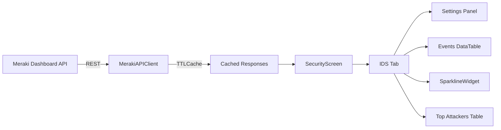

# IDS/IPS Monitoring Feature — Design Document

## 1. Architecture Overview

This feature adds Intrusion Detection/Prevention System (IDS/IPS) monitoring to the Meraki TUI application. It integrates into the existing security screen as a new tab, following the established patterns for API client methods, data models, caching, and screen composition.

### Design Approach

Rather than creating a new screen, we extend `SecurityScreen` with an **IDS/IPS** tab. This keeps all security-related views grouped together and avoids disrupting the existing `1-7` key binding navigation. The new tab provides:

1. **IDS Settings summary** — Current IDS mode and protected networks
2. **IDS Events table** — Filtered security events showing only IDS/IPS hits
3. **IDS hit-rate sparkline** — Visual trend of detection frequency
4. **Top attackers/signatures** — Aggregated views for quick triage

### Data Flow



---

## 2. Meraki API Endpoints

### Existing Endpoint (Already Implemented)

| Method | Endpoint | Current Usage |
|--------|----------|---------------|
| `get_security_events()` | `GET /networks/{networkId}/appliance/security/events` | Fetches all security events including IDS hits. In `api_client.py:208-229`. |

### New Endpoints Required

| Method | Endpoint | Purpose |
|--------|----------|---------|
| `get_org_ids_settings()` | `GET /organizations/{orgId}/appliance/security/intrusion` | Org-level IDS mode and allowed-rule whitelist |
| `get_network_ids_settings()` | `GET /networks/{networkId}/appliance/security/intrusion` | Network-level IDS mode, rules-by-ruleset, and protected networks |

### API Response Shapes

**Org-level IDS settings** (`/organizations/{orgId}/appliance/security/intrusion`):
```json
{
  "allowedRules": [
    {
      "ruleId": "meraki:intrusion/snort/GID/01/SID/688",
      "message": "DELETED DNS query to a .in TLD"
    }
  ]
}
```

**Network-level IDS settings** (`/networks/{networkId}/appliance/security/intrusion`):
```json
{
  "mode": "prevention",
  "idsRulesets": "balanced",
  "protectedNetworks": {
    "useDefault": true,
    "includedCidrs": ["10.0.0.0/8"],
    "excludedCidrs": ["10.0.1.0/24"]
  }
}
```

**Security events** (already fetched — IDS events have `eventType` values like `"IDS Alert"` and contain Snort rule data in `ruleMessage`, `signature`, `priority`, `classification` fields):
```json
{
  "ts": "2024-01-15T10:30:00Z",
  "eventType": "IDS Alert",
  "clientMac": "00:11:22:33:44:55",
  "srcIp": "192.168.1.100",
  "destIp": "10.0.0.1",
  "protocol": "tcp/http",
  "blocked": true,
  "ruleMessage": "ET MALWARE Known Bot Command and Control",
  "priority": "1",
  "classification": "A Network Trojan was detected",
  "signature": "GID/01/SID/2024897",
  "sigSource": "snort"
}
```

---

## 3. Data Model Definitions

### New Models (add to `models.py`)

```python
class IDSMode(Enum):
    DISABLED = "disabled"
    DETECTION = "detection"
    PREVENTION = "prevention"


@dataclass
class IDSAllowedRule:
    rule_id: str
    message: str = ""


@dataclass
class IDSProtectedNetworks:
    use_default: bool = True
    included_cidrs: List[str] = field(default_factory=list)
    excluded_cidrs: List[str] = field(default_factory=list)


@dataclass
class IDSSettings:
    """Network-level IDS/IPS configuration."""
    mode: IDSMode = IDSMode.DISABLED
    ruleset: str = "balanced"
    protected_networks: IDSProtectedNetworks = field(
        default_factory=IDSProtectedNetworks
    )

    @property
    def mode_icon(self) -> str:
        return {
            "disabled": "⚫",
            "detection": "🔍",
            "prevention": "🛡️",
        }.get(self.mode.value, "❓")

    @property
    def mode_label(self) -> str:
        return {
            "disabled": "Disabled",
            "detection": "Detection Only",
            "prevention": "Prevention",
        }.get(self.mode.value, "Unknown")


@dataclass
class IDSOrgSettings:
    """Org-level IDS/IPS configuration (allowed-rule whitelist)."""
    allowed_rules: List[IDSAllowedRule] = field(default_factory=list)
```

### Enhanced `SecurityEvent` Fields

The existing `SecurityEvent` model already captures the core fields. We add IDS-specific optional fields:

```python
@dataclass
class SecurityEvent:
    event_type: str
    occurred_at: Optional[datetime] = None
    network_id: str = ""
    src_ip: str = ""
    dest_ip: str = ""
    protocol: str = ""
    message: str = ""
    severity: AlertSeverity = AlertSeverity.INFO
    blocked: bool = False
    # --- NEW IDS-specific fields ---
    signature: str = ""           # e.g. "GID/01/SID/2024897"
    classification: str = ""      # e.g. "A Network Trojan was detected"
    priority: int = 0             # Snort priority 1-4
    sig_source: str = ""          # "snort" etc.
    client_mac: str = ""          # Source client MAC

    @property
    def is_ids_event(self) -> bool:
        """True if this event is an IDS/IPS detection."""
        return "ids" in self.event_type.lower() or bool(self.signature)
```

---

## 4. API Client Changes

### New Methods in `api_client.py`

```python
async def get_org_ids_settings(self, org_id: str) -> IDSOrgSettings:
    cached = self.cache.get(f"ids_org:{org_id}")
    if cached:
        return cached
    dashboard = await self._get_dashboard()
    raw = await self._call(
        org_id,
        dashboard.appliance
            .getOrganizationApplianceSecurityIntrusion(org_id),
    )
    settings = IDSOrgSettings(
        allowed_rules=[
            IDSAllowedRule(
                rule_id=r.get("ruleId", ""),
                message=r.get("message", ""),
            )
            for r in (raw or {}).get("allowedRules", [])
        ]
    )
    self.cache.set(f"ids_org:{org_id}", settings, 300)
    return settings


async def get_network_ids_settings(
    self, network_id: str, org_id: str = "global"
) -> IDSSettings:
    cached = self.cache.get(f"ids_net:{network_id}")
    if cached:
        return cached
    dashboard = await self._get_dashboard()
    raw = await self._call(
        org_id,
        dashboard.appliance
            .getNetworkApplianceSecurityIntrusion(network_id),
    )
    if not raw:
        return IDSSettings()
    pn = raw.get("protectedNetworks", {})
    settings = IDSSettings(
        mode=IDSMode(raw.get("mode", "disabled")),
        ruleset=raw.get("idsRulesets", "balanced"),
        protected_networks=IDSProtectedNetworks(
            use_default=pn.get("useDefault", True),
            included_cidrs=pn.get("includedCidrs", []),
            excluded_cidrs=pn.get("excludedCidrs", []),
        ),
    )
    self.cache.set(f"ids_net:{network_id}", settings, 300)
    return settings
```

### Enhanced `get_security_events()` — Parse IDS-Specific Fields

The existing parsing loop in `get_security_events()` needs to extract extra fields from the API response:

```python
# In the event-parsing loop, add after existing fields:
events.append(SecurityEvent(
    event_type=e.get("eventType", e.get("type", "unknown")),
    occurred_at=parse_datetime(e.get("ts") or e.get("occurredAt")),
    network_id=network_id,
    src_ip=e.get("srcIp", ""),
    dest_ip=e.get("destIp", ""),
    protocol=e.get("protocol", ""),
    message=e.get("ruleMessage", ""),
    severity=sev,
    blocked=e.get("blocked", False),
    # NEW fields:
    signature=e.get("signature", ""),
    classification=e.get("classification", ""),
    priority=int(e.get("priority", 0) or 0),
    sig_source=e.get("sigSource", ""),
    client_mac=e.get("clientMac", ""),
))
```

### Model Imports Update

Add new models to the import list at the top of `api_client.py`:

```python
from .models import (
    ...,  # existing imports
    IDSMode, IDSAllowedRule, IDSProtectedNetworks,
    IDSSettings, IDSOrgSettings,
)
```

### Cache Invalidation Update

Add IDS cache keys to `invalidate_network_cache()`:

```python
def invalidate_network_cache(self, network_id: str) -> None:
    for prefix in [
        ...,  # existing prefixes
        f"ids_net:{network_id}",
    ]:
        self.cache.invalidate_prefix(prefix)
```

---

## 5. Config Changes

### New Cache TTL in `config.py`

Add an `ids_settings_ttl` to the default cache config:

```python
"cache": {
    ...,  # existing entries
    "ids_settings_ttl": 300,      # IDS settings change infrequently
}
```

---

## 6. Security Screen Changes

### Updated Tab Layout

The `SecurityScreen` gains a fourth tab **IDS/IPS**. This is the primary deliverable of the feature.

```python
class SecurityScreen(Container):
    def compose(self) -> ComposeResult:
        with TabbedContent():
            with TabPane("Firewall Rules", id="tab-fw"):
                yield DataTable(id="fw-table")
            with TabPane("Security Events", id="tab-events"):
                yield DataTable(id="events-table")
            with TabPane("IDS/IPS", id="tab-ids"):
                yield IDSStatusPanel(id="ids-status")
                yield IDSSparkline(id="ids-sparkline")
                yield DataTable(id="ids-events-table")
                yield DataTable(id="ids-top-attackers")
            with TabPane("Content Filter", id="tab-cf"):
                yield Label("Select a network to view content filtering.",
                            id="cf-label")
```

### New Sub-Widgets for IDS Tab

**`IDSStatusPanel`** — Shows current IDS mode, ruleset, and protected networks:

```python
class IDSStatusPanel(Container):
    """Displays IDS configuration summary."""

    def compose(self) -> ComposeResult:
        yield Label("IDS/IPS Status", id="ids-title")
        yield Label("Mode: —", id="ids-mode")
        yield Label("Ruleset: —", id="ids-ruleset")
        yield Label("Protected: —", id="ids-protected")
        yield Label("Whitelisted Rules: —", id="ids-whitelist-count")

    def update_settings(
        self, net_settings: IDSSettings, org_settings: IDSOrgSettings
    ) -> None:
        self.query_one("#ids-mode").update(
            f"Mode: {net_settings.mode_icon} {net_settings.mode_label}"
        )
        self.query_one("#ids-ruleset").update(
            f"Ruleset: {net_settings.ruleset}"
        )

        pn = net_settings.protected_networks
        if pn.use_default:
            protected_text = "Default (all local subnets)"
        else:
            cidrs = ", ".join(pn.included_cidrs[:3])
            if len(pn.included_cidrs) > 3:
                cidrs += f" +{len(pn.included_cidrs) - 3} more"
            protected_text = cidrs or "None"
        self.query_one("#ids-protected").update(
            f"Protected Networks: {protected_text}"
        )
        self.query_one("#ids-whitelist-count").update(
            f"Whitelisted Rules: {len(org_settings.allowed_rules)}"
        )
```

**`IDSSparkline`** — Reuses the existing `make_sparkline()` utility to show IDS hit frequency bucketed into time intervals:

```python
class IDSSparkline(Container):
    """Shows IDS event frequency over time as a sparkline."""

    def compose(self) -> ComposeResult:
        yield Label("Detection Rate (1h buckets)", id="ids-spark-label")
        yield Label("▁" * 24, id="ids-spark-line")
        yield Label(
            "Total: 0 | Blocked: 0 | Detected: 0",
            id="ids-spark-stats",
        )

    def update_events(self, ids_events: List[SecurityEvent]) -> None:
        # Bucket events into 1-hour slots over last 24h
        from datetime import timezone, timedelta
        now = datetime.utcnow().replace(tzinfo=timezone.utc)
        buckets = [0.0] * 24
        blocked = 0
        for ev in ids_events:
            if ev.occurred_at:
                dt = ev.occurred_at
                if dt.tzinfo is None:
                    dt = dt.replace(tzinfo=timezone.utc)
                hours_ago = (now - dt).total_seconds() / 3600
                if 0 <= hours_ago < 24:
                    buckets[23 - int(hours_ago)] += 1
            if ev.blocked:
                blocked += 1

        self.query_one("#ids-spark-line").update(
            make_sparkline(buckets, 24)
        )
        self.query_one("#ids-spark-stats").update(
            f"Total: {len(ids_events)} | "
            f"Blocked: {blocked} | "
            f"Detected: {len(ids_events) - blocked}"
        )
```

### Updated `_load_all()` Method

```python
@work(exclusive=True)
async def _load_all(self) -> None:
    if not self._network:
        return
    client = get_api_client()
    org_id = self._org.id if self._org else "global"

    fw_rules, sec_events, ids_net, ids_org = await asyncio.gather(
        client.get_firewall_rules(self._network.id, org_id),
        client.get_security_events(self._network.id, org_id),
        client.get_network_ids_settings(self._network.id, org_id),
        client.get_org_ids_settings(org_id),
        return_exceptions=True,
    )

    # ... existing fw_rules and sec_events table population ...

    # --- IDS Tab ---
    if not isinstance(ids_net, Exception) and not isinstance(ids_org, Exception):
        self.query_one(IDSStatusPanel).update_settings(ids_net, ids_org)

    if not isinstance(sec_events, Exception):
        ids_events = [e for e in sec_events if e.is_ids_event]

        # Sparkline
        self.query_one(IDSSparkline).update_events(ids_events)

        # IDS Events table
        ids_table = self.query_one("#ids-events-table", DataTable)
        ids_table.clear()
        for e in ids_events[:100]:
            ids_table.add_row(
                e.severity_icon,
                format_relative_time(e.occurred_at),
                e.signature or "—",
                e.src_ip,
                e.dest_ip,
                e.protocol,
                truncate(e.message, 45),
                truncate(e.classification, 30),
                "Yes" if e.blocked else "No",
            )

        # Top Attackers aggregation
        from collections import Counter
        src_counter = Counter(e.src_ip for e in ids_events if e.src_ip)
        top_table = self.query_one("#ids-top-attackers", DataTable)
        top_table.clear()
        for ip, count in src_counter.most_common(10):
            last_event = next(
                (e for e in ids_events if e.src_ip == ip), None
            )
            top_table.add_row(
                ip,
                str(count),
                truncate(last_event.message, 40) if last_event else "—",
                format_relative_time(
                    last_event.occurred_at
                ) if last_event else "—",
            )
```

### Updated `on_mount()` for New Tables

```python
def on_mount(self) -> None:
    # ... existing fw and events table setup ...

    ids_ev = self.query_one("#ids-events-table", DataTable)
    ids_ev.add_columns(
        "", "Time", "Signature", "Src IP", "Dest IP",
        "Protocol", "Rule", "Classification", "Blocked",
    )
    top = self.query_one("#ids-top-attackers", DataTable)
    top.add_columns("Source IP", "Hits", "Last Rule", "Last Seen")
```

### Updated `action_refresh()` for IDS Cache

```python
def action_refresh(self) -> None:
    if self._network:
        client = get_api_client()
        client.cache.invalidate_prefix(f"fw_rules:{self._network.id}")
        client.cache.invalidate_prefix(f"sec_events:{self._network.id}")
        client.cache.invalidate_prefix(f"ids_net:{self._network.id}")
    if self._org:
        get_api_client().cache.invalidate_prefix(f"ids_org:{self._org.id}")
    self._load_all()
```

---

## 7. UI Layout — ASCII Mockup

```
┌─ Meraki TUI — Network Monitoring Suite ────────────────────────────────────────┐
│ Org: Acme Corp | Net: HQ-Network                                               │
├─────────┬──────────────────────────────────────────────────────────────────────┤
│ [Orgs]  │  ┌──────────────┬──────────────────┬──────────┬────────────────┐    │
│ > Acme  │  │Firewall Rules│ Security Events  │ IDS/IPS  │ Content Filter │    │
│   Beta  │  └──────────────┴──────────────────┴──────────┴────────────────┘    │
│         │                                                                      │
│ [Nets]  │  ┌─ IDS/IPS Status ─────────────────────────────────────────────┐   │
│ > HQ    │  │ Mode: 🛡️ Prevention     Ruleset: balanced                    │   │
│   BR-1  │  │ Protected Networks: Default (all local subnets)              │   │
│   BR-2  │  │ Whitelisted Rules: 3                                         │   │
│         │  └──────────────────────────────────────────────────────────────┘   │
│         │                                                                      │
│         │  ┌─ Detection Rate (1h buckets) ────────────────────────────────┐   │
│         │  │ ▁▁▂▃▅▇█▆▅▃▂▁▁▁▂▃▄▅▅▃▂▁▁▁                                   │   │
│         │  │ Total: 47 | Blocked: 38 | Detected: 9                        │   │
│         │  └──────────────────────────────────────────────────────────────┘   │
│         │                                                                      │
│         │  ┌─ IDS Events ────────────────────────────────────────────────┐    │
│         │  │   Time    Signature        Src IP       Dest IP   Proto     │    │
│         │  │   Rule                     Classification         Blocked   │    │
│         │  │ ────────────────────────────────────────────────────────── │    │
│         │  │ 🔴 5m ago  GID/01/SID/2024 192.168.1.50 10.0.0.1  tcp/http │    │
│         │  │   ET MALWARE Known Bot...  A Network Trojan...    Yes      │    │
│         │  │ 🟡 12m ago GID/01/SID/1001 10.0.5.22    8.8.8.8   udp/dns  │    │
│         │  │   ET DNS Query to .tk TLD  Potentially Bad...     No       │    │
│         │  │ ...                                                         │    │
│         │  └─────────────────────────────────────────────────────────────┘    │
│         │                                                                      │
│         │  ┌─ Top Attackers ─────────────────────────────────────────────┐    │
│         │  │ Source IP       Hits  Last Rule                  Last Seen  │    │
│         │  │ ──────────────────────────────────────────────────────────  │    │
│         │  │ 192.168.1.50      12  ET MALWARE Known Bot...   5m ago     │    │
│         │  │ 10.0.5.22          8  ET DNS Query to .tk TLD   12m ago    │    │
│         │  │ 172.16.0.99        4  ET SCAN Nmap Scripting... 1h ago     │    │
│         │  └─────────────────────────────────────────────────────────────┘    │
├──────────────────────────────────────────────────────────────────────────────┤
│ ▶ Refresh in: 24s | API calls: 42 | Errors: 0 | Cache: 18 | Last: 10:30:05 │
├──────────────────────────────────────────────────────────────────────────────┤
│ 1 Dashboard  2 Clients  3 Security  4 Analytics  5 Alerts  6 Config  q Quit │
└──────────────────────────────────────────────────────────────────────────────┘
```

---

## 8. File Change Summary

| File | Change Type | Description |
|------|-------------|-------------|
| [`models.py`](src/meraki_tui/models.py) | Modify | Add `IDSMode`, `IDSAllowedRule`, `IDSProtectedNetworks`, `IDSSettings`, `IDSOrgSettings` dataclasses. Add IDS fields to `SecurityEvent`. |
| [`api_client.py`](src/meraki_tui/api_client.py) | Modify | Add `get_org_ids_settings()` and `get_network_ids_settings()` methods. Enhance `get_security_events()` to parse IDS-specific fields. Update imports and `invalidate_network_cache()`. |
| [`security.py`](src/meraki_tui/screens/security.py) | Modify | Add IDS/IPS tab with `IDSStatusPanel`, `IDSSparkline`, events table, top-attackers table. Update `_load_all()`, `on_mount()`, `action_refresh()`. |
| [`config.py`](src/meraki_tui/config.py) | Modify | Add `ids_settings_ttl: 300` to default cache config. |

No new files need to be created. No changes to `main.py` — the screen key bindings remain the same since the feature lives within the existing Security screen.

---

## 9. Implementation Order

1. **`models.py`** — Add all new dataclasses and enhance `SecurityEvent`
2. **`config.py`** — Add `ids_settings_ttl` cache TTL
3. **`api_client.py`** — Add new API methods and update `get_security_events()` parsing
4. **`security.py`** — Add `IDSStatusPanel` and `IDSSparkline` sub-widgets; add IDS/IPS tab; update `_load_all()`, `on_mount()`, `action_refresh()`
5. **Manual testing** — Verify with a Meraki org that has IDS/IPS-capable appliances (MX series)

---

## 10. Edge Cases and Error Handling

| Scenario | Handling |
|----------|----------|
| Network has no MX appliance | `get_network_ids_settings()` returns 400/404 → `_call()` returns `None` → show "IDS not available on this network" |
| IDS is disabled | Show `IDSStatusPanel` with mode `⚫ Disabled`, events table will be empty |
| No IDS events in timespan | Sparkline shows flat line, tables show "No IDS events detected" |
| Org API error on IDS settings | Caught by `return_exceptions=True` in `asyncio.gather`, skip settings panel update |
| Rate limiting | Handled by existing `RateLimiter` — IDS settings calls counted toward 8 req/sec budget |

---

## 11. Auto-Refresh Behavior

The feature inherits the existing auto-refresh mechanism from `StatusBarWidget`:

- **Refresh interval**: Controlled by `config.refresh_interval` (default 30s)
- **Cache TTLs**:
  - IDS settings: 300s (settings change infrequently)
  - Security events (including IDS): 60s (existing `security_events_ttl`)
- On refresh, `action_refresh()` invalidates IDS-specific cache keys, then `_load_all()` re-fetches everything
- The `@work(exclusive=True)` decorator ensures only one load runs at a time, preventing API flood

---

## 12. Future Enhancements (Out of Scope)

- **IDS rule management**: Toggle IDS mode, update whitelisted rules via `PUT` endpoints
- **Cross-network IDS view**: Org-wide security events aggregation using `GET /organizations/{orgId}/appliance/security/events`
- **Alert integration**: Push IDS critical events to the Alerts screen
- **Export**: CSV/JSON export of IDS events
- **Snort rule detail modal**: Click a signature to see full rule details
